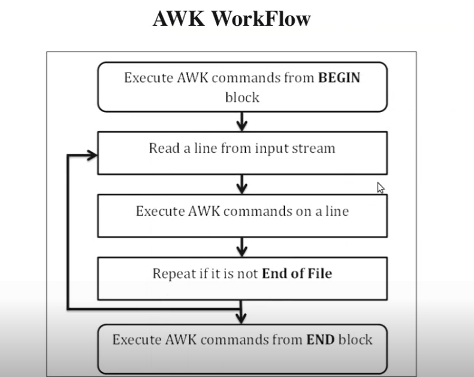

# awk




```

awk 'BEGIN {printf "hello"} {print $1}' date-rand.txt | less

awk 'BEGIN {printf "hello"} {print $1} END{printf "enf of file\n"}' date-rand.txt

awk '{print $0}' date-rand.txt      # print all things in this file
awk '{print $1}' date-rand.txt      # print column 1
awk '{print $2"\t"$1}' date-rand.txt      # print column 2

awk -v var=$USER 'BEGIN{printf "%s\n", var}' random-num-str.txt


# run when awk command stored in a file
awk -f com random-num-str.txt


```


# Internal Variable

```


```